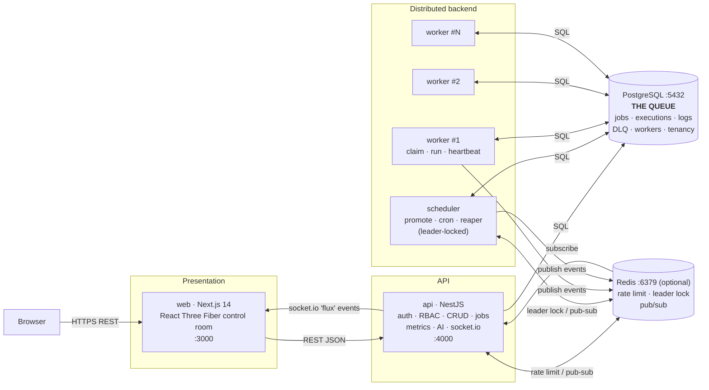
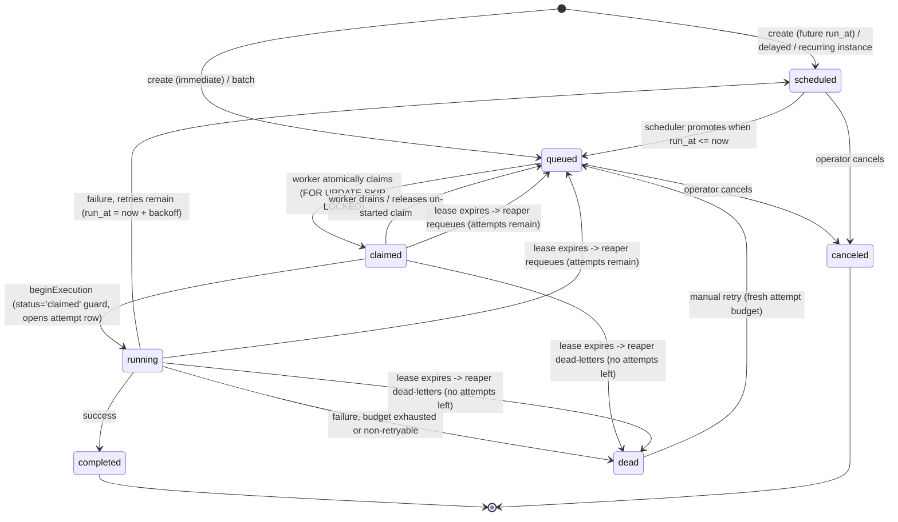

# Architecture

Flux is a monorepo of four deployable services and five shared packages. The organizing
idea is simple and load-bearing: **PostgreSQL is the queue.** Every service is a thin,
stateless (or singleton-locked) runtime around a transactional engine — [`@flux/core`](../packages/core) —
whose correctness is proven directly against a real Postgres. Redis is used only for
cross-process concerns (rate limiting, leader election, event fan-out) and always has an
in-memory fallback.

## System diagram



Every job/worker event published by a worker or the scheduler flows onto the **EventBus**
(Redis pub/sub across replicas, in-memory within a process). The API subscribes and relays
each event to dashboards over socket.io as a `"flux"` message, so the UI animates from real
state rather than fabricated activity.

## Services and responsibilities

### `api` (NestJS, port 4000)

The only public entry point. Cross-cutting concerns are enforced globally in a fixed order:
`requestId` middleware → **JwtAuthGuard** (Bearer JWT, else `@Public()`) → **RateLimitGuard**
(token bucket per identity) → **RolesGuard** (org-scoped RBAC), and every thrown error is
serialized by a single **AllExceptionsFilter** into the structured envelope
`{ error, code, details, requestId, statusCode }`.

Responsibilities:

- **Auth** — signup/login/refresh/logout/me. argon2id password hashing, short-lived access
  JWT + rotating refresh tokens (reuse of a rotated token revokes the whole family).
- **Tenancy & RBAC** — organizations, members (`owner` > `admin` > `member`), projects,
  API keys. `AuthzService` resolves the owning org for any resource (project/queue/job) so
  tenant isolation and role checks happen in one place.
- **Catalog** — queues (with fleet-wide `concurrencyLimit`, priority default, pause flag),
  retry policies, cron schedules.
- **Jobs** — create (all 5 types, honoring the `Idempotency-Key` header), list/filter,
  detail (job + executions + logs + DLQ + worker), manual retry, cancel.
- **Observability** — queue/project stats, worker fleet + heartbeats, dead-letter queue,
  Prometheus `/metrics`, and AI-assisted failure summaries.
- **Real-time** — a socket.io gateway bridging the EventBus to dashboards.

The API is **stateless**: it owns a Postgres pool and (optionally) a Redis client, but
holds no per-request state, so it scales horizontally behind a load balancer.

### `scheduler` (leader-locked singleton)

Runs three duties on a fixed interval (`SCHEDULER_TICK_MS`, default 1000ms), each guarded
by a distributed **leader lock** so that N replicas can run for HA while only one does work
per tick:

1. **`promoteDueJobs`** — flip `scheduled` jobs whose `run_at <= now()` to `queued`
   (covers delayed jobs, future-dated jobs, and retry-backoff jobs).
2. **`tickSchedules`** — for each enabled cron schedule due now, enqueue one instance and
   advance `next_run_at` using the cron expression in its timezone.
3. **`reapExpiredLeases`** — dead-worker recovery: reclaim in-flight jobs whose lease has
   expired.

Plus light maintenance (mark stale workers `dead`, prune old heartbeats). The lock is held
only for the duration of a tick, and every SQL statement is idempotent under races
(`FOR UPDATE SKIP LOCKED` / conditional `UPDATE`), so even a lock hiccup can't cause
double-promotion or duplicate cron fires.

### `worker` (scale to N)

A thin runtime around the engine:

- registers itself, then **heartbeats** every `WORKER_HEARTBEAT_MS` — each beat extends the
  lease on every job it holds;
- polls for queues with ready work, then **atomically claims** up to its free capacity;
- executes claimed jobs concurrently, bounded by `WORKER_MAX_CONCURRENCY`;
- on `SIGTERM`/`SIGINT` **drains**: stop claiming, finish in-flight work (still
  heartbeating), release un-started claims, and deregister — so a rolling deploy never
  loses or double-runs a job.

Workers are fully symmetric and share nothing; scaling the fleet is just running more of
them.

### `web` (Next.js 14, port 3000)

The dashboard. A React Three Fiber "control room" plus TanStack Query for REST reads and a
socket.io client for the live `flux` event stream. It polls the API as a reliable baseline
and overlays real-time animation from events.

## Shared packages

| Package | Role |
| --- | --- |
| [`@flux/shared`](../packages/shared) | Single source of truth for enums (job/worker/execution statuses, job types, roles, retry strategies, DLQ reasons), Zod DTO schemas, the `FluxEvent` union, error codes, and pagination contract. Consumed by the DB schema, the API, and (indirectly) the web app so nothing can drift. |
| [`@flux/db`](../packages/db) | Drizzle schema (15 tables) as the single source of truth, migrations, and the pooled client (`createDb`). Re-exports drizzle query helpers so every consumer stays on one drizzle instance. |
| [`@flux/core`](../packages/core) | The distributed engine: `claim`, `lifecycle` (begin/complete/fail/retry), `reaper`, `promote`/cron, `enqueue`, and `workers`. Pure functions over a `Database` handle — no framework, no HTTP — so they're directly testable against real Postgres. |
| [`@flux/infra`](../packages/infra) | `EventBus`, `DistributedLock`, and `RateLimiter`, each an interface with a Redis implementation and an in-memory fallback, plus a pino logger. |
| [`@flux/testing`](../packages/testing) | The embedded-Postgres harness (`createTestDb`, `seedQueue`) that boots a real, throwaway Postgres with the production migrations applied. |

## The lifecycle of a job



Statuses come from [`@flux/shared`](../packages/shared/src/enums.ts):
`scheduled · queued · claimed · running · completed · failed · dead · canceled`. Key points:

- **`queued` always means "ready now."** Anything not yet runnable (delayed, future-dated,
  or resting in retry backoff) sits in `scheduled` until the scheduler promotes it. This
  keeps the claim index — a partial index over only `queued` rows — small and hot.
- **Failures with retries left rest in `scheduled`**, with `run_at = now + backoff`. They
  re-enter the queue only when the scheduler promotes them, which unifies delayed jobs and
  retry-backoff jobs into one promotion path.
- **`dead` jobs have a `dead_letter_queue` row**, so the DLQ is a first-class, browsable
  fact, not a status filter.
- Every attempt is an append-only row in `job_executions`; retrying never mutates prior
  attempts, giving a complete audit trail.

## The claim protocol (no double execution)

Workers claim in a single transaction. The core of [`claim.ts`](../packages/core/src/engine/claim.ts):

```sql
-- (1) serialize claims for THIS queue only; released at COMMIT
SELECT pg_advisory_xact_lock(hashtext($queueId));

-- (2) capacity check: skip paused queues; respect the fleet-wide limit
SELECT concurrency_limit, paused FROM queues WHERE id = $queueId;
SELECT count(*) FROM jobs WHERE queue_id = $queueId AND status IN ('claimed','running');
-- take = min(worker_free_capacity, concurrency_limit - running)

-- (3) the atomic claim
UPDATE jobs
SET status='claimed', claimed_by=$worker, claimed_at=now(),
    lease_expires_at = now() + ($leaseSeconds || ' seconds')::interval
WHERE id IN (
  SELECT id FROM jobs
  WHERE status='queued' AND queue_id=$queueId AND run_at <= now()
  ORDER BY priority DESC, run_at ASC
  FOR UPDATE SKIP LOCKED          -- concurrent workers skip locked rows, never block
  LIMIT $take
)
RETURNING ...;
```

Two independent guarantees stack here:

- **`FOR UPDATE SKIP LOCKED`** means two workers never receive the same row: the first
  locks it inside its transaction, the second skips past it. The partial `jobs_claim_idx`
  `(queue_id, priority DESC, run_at ASC) WHERE status='queued'` makes the inner select a
  pre-sorted, index-only scan.
- **`pg_advisory_xact_lock(hashtext(queueId))`** serializes the capacity check *per queue*
  (other queues proceed in parallel). Without it, two workers could each read `running=R`
  and each claim up to `limit-R` *different* rows — and together exceed the limit. See
  [`docs/DESIGN_DECISIONS.md`](DESIGN_DECISIONS.md) for the full analysis.

`beginExecution` then transitions `claimed → running` guarded by
`WHERE status='claimed' AND claimed_by=$worker`, so a job that was reaped or stolen between
claim and start is safely skipped. The `(job_id, attempt_no)` unique index on
`job_executions` is a final, DB-level backstop against ever recording the same attempt twice.

### Sequence: worker claims and executes a job

```mermaid
sequenceDiagram
    autonumber
    participant W as Worker
    participant PG as Postgres
    participant Bus as EventBus
    participant API as API (socket.io)

    W->>PG: BEGIN
    W->>PG: pg_advisory_xact_lock(hashtext(queueId))
    W->>PG: SELECT concurrency_limit, paused, count(running)
    Note over W,PG: take = min(freeCapacity, limit - running)
    W->>PG: UPDATE jobs SET status='claimed', lease_expires_at=now()+lease<br/>WHERE id IN (SELECT ... FOR UPDATE SKIP LOCKED LIMIT take)
    PG-->>W: claimed rows
    W->>PG: COMMIT (advisory lock released)
    W-->>Bus: job.claimed
    Bus-->>API: relay -> socket.io "flux"

    W->>PG: beginExecution: UPDATE ... status='running', attempts=N<br/>WHERE status='claimed' AND claimed_by=W; INSERT job_executions
    alt lost the race (reaped/canceled)
        PG-->>W: rowCount = 0  -> drop job
    else started
        PG-->>W: executionId
        W-->>Bus: job.started
        loop while running
            W->>PG: INSERT job_logs (streamed)
            W-->>Bus: job.log
            Note over W: heartbeat timer extends lease_expires_at for all in-flight jobs
        end
        alt success
            W->>PG: completeJob: execution=completed, job=completed
            W-->>Bus: job.completed
        else failure
            W->>PG: failJob: execution=failed
            alt retries remain
                W->>PG: job status='scheduled', run_at=now+backoff
                W-->>Bus: job.failed (willRetry=true)
            else exhausted / non-retryable
                W->>PG: job status='dead' + INSERT dead_letter_queue
                W-->>Bus: job.failed + job.dead
            end
        end
    end
```

## The lease / heartbeat / reaper protocol (no lost jobs)

Every claim carries a `lease_expires_at`. Liveness is derived from the lease, **not** a
wall-clock timeout:

- A live worker calls `heartbeat` on a timer. Each beat updates the worker's
  `last_heartbeat_at`, appends a `worker_heartbeats` row, and — crucially —
  **extends `lease_expires_at` on every job it holds** (`WHERE claimed_by=$worker AND
  status IN ('claimed','running')`).
- When a worker crashes, is killed, or is partitioned, its heartbeats stop, so its jobs'
  leases lapse. The scheduler's `reapExpiredLeases` scans `jobs_lease_idx`
  `(lease_expires_at) WHERE status IN ('claimed','running')` for expired in-flight jobs
  (`FOR UPDATE SKIP LOCKED`, so multiple reaper replicas are safe), marks the mid-flight
  attempt `lost`, and either **requeues** the job (attempts remain) or **dead-letters** it
  (`lease_expired_max_attempts`).

Because recovery keys off the lease, a *slow-but-alive* worker — one still heartbeating —
keeps pushing its leases into the future and is **never** wrongly reaped. Only genuine
silence triggers recovery.

### Sequence: dead-worker recovery via expired lease

```mermaid
sequenceDiagram
    autonumber
    participant WA as Worker A (dies)
    participant PG as Postgres
    participant S as Scheduler (reaper)
    participant WB as Worker B
    participant Bus as EventBus

    WA->>PG: claim job J, lease_expires_at = now()+30s
    WA->>PG: beginExecution J (attempt 1, status='running')
    Note over WA: 💥 crash — heartbeats stop, lease no longer extended
    Note over PG: clock advances past lease_expires_at

    loop every tick (leader-locked)
        S->>PG: SELECT ... FROM jobs<br/>WHERE status IN ('claimed','running') AND lease_expires_at < now()<br/>FOR UPDATE SKIP LOCKED
        PG-->>S: job J (attempts=1, max=3)
        S->>PG: UPDATE job_executions SET status='lost' WHERE job=J AND status='running'
        alt attempts < max_attempts
            S->>PG: UPDATE jobs SET status='queued', run_at=now(), claimed_by=NULL
            S-->>Bus: job.created (requeued)
        else exhausted
            S->>PG: UPDATE jobs SET status='dead'; INSERT dead_letter_queue (lease_expired_max_attempts)
            S-->>Bus: job.dead
        end
    end

    WB->>PG: claim job J (attempts still = 1)
    WB->>PG: beginExecution J (attempt 2)
    WB->>PG: completeJob J
    WB-->>Bus: job.completed
    Note over PG: job_executions: attempt 1 = lost, attempt 2 = completed
```

## How it scales horizontally

- **API** — stateless; run as many replicas as you need behind a load balancer. Redis
  makes rate-limit buckets and event fan-out correct across replicas.
- **Workers** — symmetric and shared-nothing. Add processes (`docker compose up
  --scale worker=3`) to add throughput. Correctness is unaffected: `FOR UPDATE SKIP LOCKED`
  hands disjoint rows to each worker, per-queue advisory locks keep the fleet-wide
  concurrency limit exact, and leases recover anything a crashed worker was holding.
- **Scheduler** — run replicas for availability; the Redis leader lock ensures only one
  promotes/reaps per tick. With no Redis, run a single scheduler (the in-memory lock is a
  process-local no-op guard).
- **Postgres** — the single source of truth and the natural coordination point. Read-heavy
  dashboards can be pointed at a replica; the claim path is deliberately index-tight (see
  [`docs/DATABASE.md`](DATABASE.md)) so the hot table stays small and cache-resident.

The throughput ceiling is Postgres, not application coordination — a deliberate trade
discussed in [`docs/DESIGN_DECISIONS.md`](DESIGN_DECISIONS.md).
