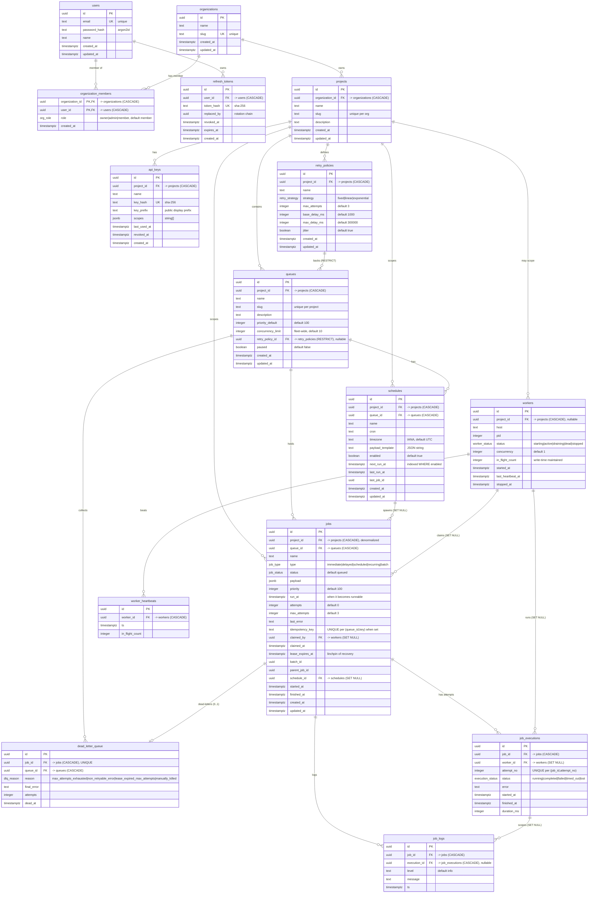

# Entity-Relationship Model

Flux's schema is **15 tables in five domains**, defined in
[`packages/db/src/schema`](../packages/db/src/schema) as the single source of truth (its
enums are shared with the application via `@flux/shared` so the two can never drift). Every
table has a `uuid` primary key defaulted with `gen_random_uuid()`; the one composite PK is
`organization_members (organization_id, user_id)`.

This document is the map. For the full rationale behind every key, cascade rule, and index,
see [`docs/DATABASE.md`](DATABASE.md).

| Domain | Tables |
| --- | --- |
| Identity & tenancy | `users`, `organizations`, `organization_members`, `refresh_tokens`, `projects`, `api_keys` |
| Catalog | `retry_policies`, `queues`, `schedules` |
| The queue | `jobs`, `job_executions`, `job_logs`, `dead_letter_queue` |
| Fleet | `workers`, `worker_heartbeats` |

## Diagram

## Cascade & restrict rules (summary)

The deletion model follows one principle: **tearing down a tenant is a single `DELETE`,
but you can never accidentally strand live work.**

- **`CASCADE` down the tenancy tree.** Deleting an organization removes its projects, and
  with them every queue, retry policy, schedule, job, and worker
  (`*.project_id → projects` and `projects.organization_id → organizations` are all
  `CASCADE`). Job-owned rows (`job_executions`, `job_logs`, `dead_letter_queue`) and
  `worker_heartbeats` cascade from their parents. Membership and refresh tokens cascade
  from the user/org.
- **`RESTRICT` on `queues.retry_policy_id → retry_policies`.** A retry policy that is in use
  by a queue **cannot be deleted directly** — you must reassign the queue first. This
  protects a running queue from silently losing its backoff configuration. The API surfaces
  the resulting FK error as a `CONFLICT`.
- **`SET NULL` where history must outlive a relationship.** `jobs.claimed_by → workers`,
  `jobs.schedule_id → schedules`, `job_executions.worker_id → workers`, and
  `job_logs.execution_id → job_executions` all `SET NULL`, so removing a worker or schedule
  preserves the job's attempt/log history (the reaper then requeues any dangling claims).

The `RESTRICT + CASCADE` "diamond" (`project → queues`, `project → retry_policies`,
`queues → retry_policies`) is a known footgun — a full analysis, plus the exact index list
and the reasoning behind each denormalization, lives in [`docs/DATABASE.md`](DATABASE.md).
